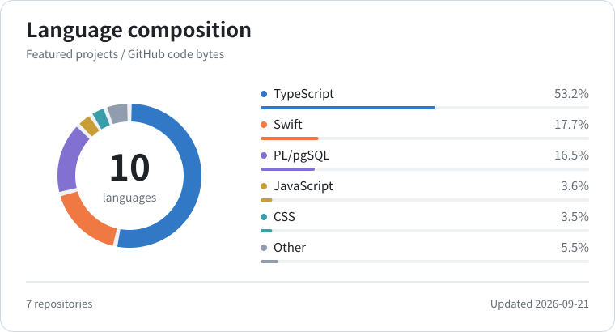

  <strong>English</strong>
  ·
  <a href="./README.zh-CN.md">简体中文</a>

###  AI · Spatial Computing · Apple Platforms · Full-stack Engineering

Creating intelligent, accessible and human-centered experiences.

## Projects

<table>
  <tr>
    <td width="50%" valign="top">
      <h3><a href="https://github.com/zs-andy/TOMEET-Web">TOMEET</a></h3>
      
A conversational social Agent that turns ongoing dialogue into real-world connections.

      
Product direction · Interface design · Frontend &amp; backend engineering

      
<strong>AdventureX track 1st place.</strong>

      

        
        
      

      
<code>Next.js</code> <code>TypeScript</code> <code>Fastify</code> <code>Supabase</code>

    </td>
    <td width="50%" valign="top">
      <h3><a href="https://github.com/zs-andy/Atmos_Rokid">Atmos Rokid</a></h3>
      
Real-time environmental awareness for visually impaired users, built for Rokid Glasses.

      
<strong>AdventureX track 4th place.</strong>

      

      
<code>Kotlin</code> <code>YOLO</code> <code>FastVLM</code>

    </td>
  </tr>
  <tr>
    <td width="50%" valign="top">
      <h3><a href="https://github.com/zs-andy/DeadLineTodo">DeadLineTodo</a></h3>
      
A deadline-first task manager for iOS, available on the App Store.

      

      
<code>Swift</code> <code>SwiftUI</code>

    </td>
    <td width="50%" valign="top">
      <h3><a href="https://github.com/zs-andy/SoulHealing">SoulHealing</a></h3>
      
An experiment combining emotion recognition, multimodal AI and music therapy.

      

      
<code>SwiftUI</code> <code>LLM</code> <code>FastVLM</code>

    </td>
  </tr>
  <tr>
    <td width="50%" valign="top">
      <h3><a href="https://github.com/zs-andy/VisionKeyboard">VisionKeyboard</a></h3>
      
A 26-key spatial keyboard for Apple Vision Pro using fingertip tracking.

      

      
<code>Swift</code> <code>visionOS</code> <code>Computer Vision</code>

    </td>
    <td width="50%"></td>
  </tr>
</table>

## Stack

<picture>
  <source
    media="(prefers-color-scheme: dark)"
    srcset="./assets/languages-dark.svg"
  />
  <source
    media="(prefers-color-scheme: light)"
    srcset="./assets/languages-light.svg"
  />
  
</picture>

 

