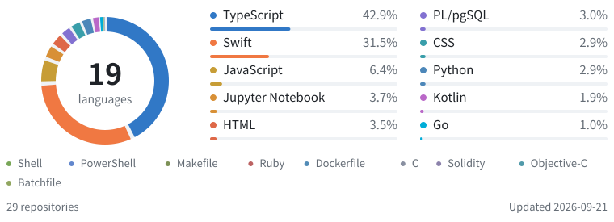

# 4Fe_Andy

AI · Spatial Computing · Product Management · Design · Full-stack Engineering Creating intelligent and accessible experiences across Apple platforms, the web, and beyond.

  <a href="https://4fe-andy.github.io/">Website ↗</a> &nbsp;·&nbsp;
  <a href="https://www.instagram.com/4fe_andy/">Instagram ↗</a> &nbsp;·&nbsp;
  <a href="https://www.youtube.com/@4FeAndy">YouTube ↗</a> &nbsp;·&nbsp;
  <a href="https://open.spotify.com/user/31mix2lsown7l4ycqak56qbeq6yy">Spotify ↗</a>

  <a href="#projects">Projects</a> &nbsp;/&nbsp;
  <a href="#stack">Stack</a> &nbsp;/&nbsp;
  <a href="#stats">Stats</a> &nbsp;/&nbsp;
  <a href="./README.zh-CN.md">简体中文</a>

## Projects

### [TOMEET ↗](https://github.com/tomeet-chat/TOMEET-Web) · AGENT &nbsp; / &nbsp; AdventureX track 1st place

A conversational social Agent that turns ongoing dialogue into real-world connections. Product direction · Interface design · Frontend & backend engineering `Next.js` `Fastify` `Supabase` `Photon Spectrum` `Agent Memory V2` `Injective Web3`

[Frontend ↗](https://github.com/tomeet-chat/TOMEET-Web) &nbsp;·&nbsp; [Backend ↗](https://github.com/toMeetADX/TOMEET_Backend)

### [Atmos Rokid ↗](https://github.com/zs-andy/Atmos_Rokid) · SPATIAL COMPUTING

Real-time environmental awareness for visually impaired users, built for Rokid Glasses. `Kotlin` `Swift` `Rokid Glasses` `YOLO12 · Core ML` `FastVLM · MLX`

### [DeadLineTodo ↗](https://github.com/zs-andy/DeadLineTodo) · iOS PRODUCT &nbsp; / &nbsp; Available on the App Store

A deadline-first task manager for iOS, available on the App Store. `Swift` `SwiftUI` `SwiftData` `StoreKit 2` `WidgetKit` `EventKit`

### [SoulHealing ↗](https://github.com/zs-andy/SoulHealing) · EMOTION & AI

An experiment combining emotion recognition, multimodal AI and music therapy. `SwiftUI` `AVFoundation` `FastVLM` `MLX VLM` `Core ML Vision`

### [VisionKeyboard ↗](https://github.com/zs-andy/VisionKeyboard) · visionOS &nbsp; / &nbsp; AdventureX track 4th place

A 26-key spatial keyboard for Apple Vision Pro using fingertip tracking. `Swift` `visionOS` `ARKit Hand Tracking` `RealityKit` `Plane Detection` `Spatial Gestures`

### [RSNA 2024 · YOLO Approach ↗](https://github.com/zs-andy/LSDC-Yolo-Approach) · KAGGLE COMPETITION &nbsp; / &nbsp; Silver Medal

An object-detection approach for the Kaggle RSNA 2024 Lumbar Spine Degenerative Classification competition. `Python` `PyTorch` `YOLOv8 Ensemble` `3D DICOM` `MaxViT` `Multi-scale Inference`

## Stack

**Languages** &nbsp; Swift · Kotlin · Python · TypeScript **Web & data** &nbsp; React · Next.js · Supabase **Vision & tools** &nbsp; PyTorch · OpenCV · Git

## Stats

<picture>
  <source media="(max-width: 600px) and (prefers-color-scheme: dark)" srcset="./assets/contribution-languages-v2-inline-mobile-dark.svg" />
  <source media="(max-width: 600px)" srcset="./assets/contribution-languages-v2-inline-mobile-light.svg" />
  <source media="(prefers-color-scheme: dark)" srcset="./assets/contribution-languages-v2-inline-dark.svg" />
  
</picture>

Repositories with my commits · public + authorized private · language mix.

Data & methodology

Includes repositories where GitHub attributes a commit to **zs-andy** as author or committer—not just repositories I own. Global commit search is supplemented with current-branch checks for repositories accessible through ownership, collaboration or organization membership. Public, authorized private, archived and fork repositories are eligible; each repository is counted once. Coverage is limited by token permissions, GitHub indexing and linked commit identities; deleted or inaccessible history cannot be included.

The chart uses a repository-normalized language mix: each included repository with language data contributes equally after its own GitHub Linguist proportions are calculated. This keeps one unusually large repository from overwhelming the overview. It is **not the lines I personally wrote**, time spent or proficiency. All detected languages remain available in the chart; the ten largest get bars and the smaller ones appear in the compact key. Notebook files retain GitHub's “Jupyter Notebook” classification. Forks are counted separately and may share code with their upstream repositories.

Only aggregate language totals and repository counts are published—no repository identifiers, commit records or per-repository details. A weekly refresh is scheduled; it requires a configured access credential and otherwise preserves the last snapshot. [Refresh setup](./docs/profile-stats.md).

[Current data & full language breakdown](./assets/language-data.json) · [Generator](./scripts/update-language-card.mjs) · [Update status](https://github.com/zs-andy/zs-andy/actions/workflows/update-language-card.yml)

  <a href="https://github.com/zs-andy?tab=repositories">All repositories ↗</a> &nbsp;·&nbsp; <a href="https://4fe-andy.github.io/">Elsewhere on the web ↗</a>

