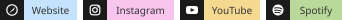

  <strong>English</strong>
  ·
  <a href="./README.zh-CN.md">简体中文</a>

###  AI · Spatial Computing · Product · Design · Full-stack Engineering

Creating intelligent and accessible experiences across Apple platforms and the web.

## Projects

<table>
  <tr>
    <td width="50%" valign="top">
      <h3><a href="https://github.com/zs-andy/TOMEET-Web">TOMEET</a></h3>
      
A conversational social Agent that turns ongoing dialogue into real-world connections.

      

      
Product direction · Interface design · Frontend &amp; backend engineering

      
<strong>AdventureX track 1st place.</strong>

      
<a href="https://github.com/zs-andy/TOMEET-Web"><kbd>Frontend ↗</kbd></a>&ensp;<a href="https://github.com/toMeetADX/TOMEET_Backend"><kbd>Backend ↗</kbd></a>

      
<code>Next.js</code> <code>Fastify</code> <code>Supabase</code> <code>Photon Spectrum</code> <code>Agent Memory V2</code> <code>Injective Web3</code>

    </td>
    <td width="50%" valign="top">
      <h3><a href="https://github.com/zs-andy/Atmos_Rokid">Atmos Rokid</a></h3>
      
Real-time environmental awareness for visually impaired users, built for Rokid Glasses.

      

      
<code>Kotlin</code> <code>Swift</code> <code>Rokid Glasses</code> <code>YOLO12 · Core ML</code> <code>FastVLM · MLX</code>

    </td>
  </tr>
  <tr>
    <td width="50%" valign="top">
      <h3><a href="https://github.com/zs-andy/DeadLineTodo">DeadLineTodo</a></h3>
      
A deadline-first task manager for iOS, available on the App Store.

      

      
<code>Swift</code> <code>SwiftUI</code> <code>SwiftData</code> <code>StoreKit 2</code> <code>WidgetKit</code> <code>EventKit</code>

    </td>
    <td width="50%" valign="top">
      <h3><a href="https://github.com/zs-andy/SoulHealing">SoulHealing</a></h3>
      
An experiment combining emotion recognition, multimodal AI and music therapy.

      

      
<code>SwiftUI</code> <code>AVFoundation</code> <code>FastVLM</code> <code>MLX VLM</code> <code>Core ML Vision</code>

    </td>
  </tr>
  <tr>
    <td width="50%" valign="top">
      <h3><a href="https://github.com/zs-andy/VisionKeyboard">VisionKeyboard</a></h3>
      
A 26-key spatial keyboard for Apple Vision Pro using fingertip tracking.

      
<strong>AdventureX track 4th place.</strong>

      

      
<code>Swift</code> <code>visionOS</code> <code>ARKit Hand Tracking</code> <code>RealityKit</code> <code>Plane Detection</code> <code>Spatial Gestures</code>

    </td>
    <td width="50%" valign="top">
      <h3><a href="https://github.com/zs-andy/LSDC-Yolo-Approach">RSNA 2024 · YOLO Approach</a></h3>
      
An object-detection approach for the Kaggle RSNA 2024 Lumbar Spine Degenerative Classification competition.

      
<strong>Kaggle Silver Medal.</strong>

      

      
<code>Python</code> <code>PyTorch</code> <code>YOLOv8 Ensemble</code> <code>3D DICOM</code> <code>MaxViT</code> <code>Multi-scale Inference</code>

    </td>
  </tr>
</table>

## Stack

<picture>
  <source
    media="(prefers-color-scheme: dark)"
    srcset="./assets/languages-dark.svg"
  />
  <source
    media="(prefers-color-scheme: light)"
    srcset="./assets/languages-light.svg"
  />
  
</picture>

 

