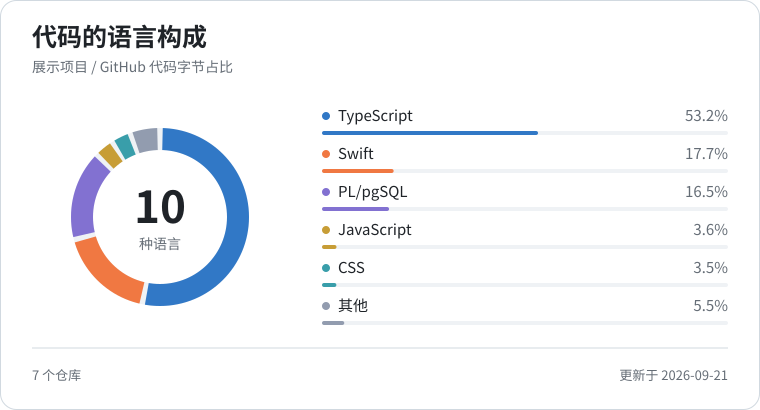

# 4Fe_Andy

人工智能 · 空间计算 · 产品管理 · 设计 · 全栈工程

构建面向 Apple 平台与 Web 的智能、无障碍产品体验。

  <a href="https://4fe-andy.github.io/">个人网站 ↗</a> &nbsp;·&nbsp;
  <a href="https://www.instagram.com/4fe_andy/">Instagram ↗</a> &nbsp;·&nbsp;
  <a href="https://www.youtube.com/@4FeAndy">YouTube ↗</a> &nbsp;·&nbsp;
  <a href="https://open.spotify.com/user/31mix2lsown7l4ycqak56qbeq6yy">Spotify ↗</a>

 

  <a href="#项目">项目</a> &nbsp;/&nbsp;
  <a href="#技术栈">技术栈</a> &nbsp;/&nbsp;
  <a href="#统计">统计</a> &nbsp;/&nbsp;
  <a href="./README.md">English</a>

## 项目

### [TOMEET ↗](https://github.com/tomeet-chat/TOMEET-Web)

AGENT &nbsp; / &nbsp; AdventureX 赛道第一名

一个通过持续对话理解用户，并帮助用户建立真实社交连接的智能 Agent。

产品方向 · 界面设计 · 前后端工程开发

`Next.js` `Fastify` `Supabase` `Photon Spectrum` `Agent Memory V2` `Injective Web3`

[前端 ↗](https://github.com/tomeet-chat/TOMEET-Web) &nbsp;·&nbsp; [后端 ↗](https://github.com/toMeetADX/TOMEET_Backend)

 

### [Atmos Rokid ↗](https://github.com/zs-andy/Atmos_Rokid)

空间计算

基于 Rokid Glasses，为视障用户提供实时环境感知的空间计算应用。

`Kotlin` `Swift` `Rokid Glasses` `YOLO12 · Core ML` `FastVLM · MLX`

 

### [DeadLineTodo ↗](https://github.com/zs-andy/DeadLineTodo)

iOS 产品 &nbsp; / &nbsp; 已上架 App Store

专注 Deadline 管理、已上架 App Store 的 iOS 待办应用。

`Swift` `SwiftUI` `SwiftData` `StoreKit 2` `WidgetKit` `EventKit`

 

### [SoulHealing ↗](https://github.com/zs-andy/SoulHealing)

情绪与 AI

结合情绪识别、多模态 AI 与音乐疗愈的实验性应用。

`SwiftUI` `AVFoundation` `FastVLM` `MLX VLM` `Core ML Vision`

 

### [VisionKeyboard ↗](https://github.com/zs-andy/VisionKeyboard)

visionOS &nbsp; / &nbsp; AdventureX 赛道第四名

基于指尖追踪的 Apple Vision Pro 26 键空间手势输入法。

`Swift` `visionOS` `ARKit Hand Tracking` `RealityKit` `Plane Detection` `Spatial Gestures`

 

### [RSNA 2024 · YOLO Approach ↗](https://github.com/zs-andy/LSDC-Yolo-Approach)

KAGGLE 竞赛 &nbsp; / &nbsp; 银牌

面向 Kaggle RSNA 2024 腰椎退行性病变分类竞赛的目标检测方案。

`Python` `PyTorch` `YOLOv8 Ensemble` `3D DICOM` `MaxViT` `Multi-scale Inference`

 

## 技术栈

**编程语言** &nbsp; Swift · Kotlin · Python · TypeScript 
**Web 与数据** &nbsp; React · Next.js · Supabase 
**视觉与工具** &nbsp; PyTorch · OpenCV · Git

 

## 统计

<picture>
  <source media="(max-width: 600px) and (prefers-color-scheme: dark)" srcset="./assets/language-composition-zh-CN-mobile-dark.svg" />
  <source media="(max-width: 600px)" srcset="./assets/language-composition-zh-CN-mobile-light.svg" />
  <source media="(prefers-color-scheme: dark)" srcset="./assets/language-composition-zh-CN-dark.svg" />
  
</picture>

展示代码构成，不代表熟练程度。每周通过 GitHub 语言 API 自动更新。

数据与统计方法

统计范围为六个项目、七个公开仓库（TOMEET 包含前端和后端）。百分比按 GitHub 返回的代码字节数汇总，不代表提交次数、投入时间或该账号全部仓库。单独展示占比最高的五种语言，其余合并为「其他」。Notebook 文件保留 GitHub 的「Jupyter Notebook」分类。

[当前数据与完整语言明细](./assets/language-data.json) · [生成脚本](./scripts/update-language-card.mjs) · [更新状态](https://github.com/zs-andy/zs-andy/actions/workflows/update-language-card.yml)

 

  <a href="https://github.com/zs-andy?tab=repositories">全部仓库 ↗</a> &nbsp;·&nbsp; <a href="https://4fe-andy.github.io/">个人网站 ↗</a>

