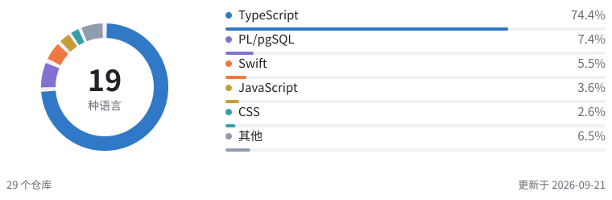

# 4Fe_Andy

人工智能 · 空间计算 · 产品管理 · 设计 · 全栈工程 构建面向 Apple 平台与 Web 的智能、无障碍产品体验。

  <a href="https://4fe-andy.github.io/">个人网站 ↗</a> &nbsp;·&nbsp;
  <a href="https://www.instagram.com/4fe_andy/">Instagram ↗</a> &nbsp;·&nbsp;
  <a href="https://www.youtube.com/@4FeAndy">YouTube ↗</a> &nbsp;·&nbsp;
  <a href="https://open.spotify.com/user/31mix2lsown7l4ycqak56qbeq6yy">Spotify ↗</a>

  <a href="#项目">项目</a> &nbsp;/&nbsp;
  <a href="#技术栈">技术栈</a> &nbsp;/&nbsp;
  <a href="#统计">统计</a> &nbsp;/&nbsp;
  <a href="./README.md">English</a>

## 项目

### [TOMEET ↗](https://github.com/tomeet-chat/TOMEET-Web) · AGENT &nbsp; / &nbsp; AdventureX 赛道第一名

一个通过持续对话理解用户，并帮助用户建立真实社交连接的智能 Agent。 产品方向 · 界面设计 · 前后端工程开发 `Next.js` `Fastify` `Supabase` `Photon Spectrum` `Agent Memory V2` `Injective Web3`

[前端 ↗](https://github.com/tomeet-chat/TOMEET-Web) &nbsp;·&nbsp; [后端 ↗](https://github.com/toMeetADX/TOMEET_Backend)

### [Atmos Rokid ↗](https://github.com/zs-andy/Atmos_Rokid) · 空间计算

基于 Rokid Glasses，为视障用户提供实时环境感知的空间计算应用。 `Kotlin` `Swift` `Rokid Glasses` `YOLO12 · Core ML` `FastVLM · MLX`

### [DeadLineTodo ↗](https://github.com/zs-andy/DeadLineTodo) · iOS 产品 &nbsp; / &nbsp; 已上架 App Store

专注 Deadline 管理、已上架 App Store 的 iOS 待办应用。 `Swift` `SwiftUI` `SwiftData` `StoreKit 2` `WidgetKit` `EventKit`

### [SoulHealing ↗](https://github.com/zs-andy/SoulHealing) · 情绪与 AI

结合情绪识别、多模态 AI 与音乐疗愈的实验性应用。 `SwiftUI` `AVFoundation` `FastVLM` `MLX VLM` `Core ML Vision`

### [VisionKeyboard ↗](https://github.com/zs-andy/VisionKeyboard) · visionOS &nbsp; / &nbsp; AdventureX 赛道第四名

基于指尖追踪的 Apple Vision Pro 26 键空间手势输入法。 `Swift` `visionOS` `ARKit Hand Tracking` `RealityKit` `Plane Detection` `Spatial Gestures`

### [RSNA 2024 · YOLO Approach ↗](https://github.com/zs-andy/LSDC-Yolo-Approach) · KAGGLE 竞赛 &nbsp; / &nbsp; 银牌

面向 Kaggle RSNA 2024 腰椎退行性病变分类竞赛的目标检测方案。 `Python` `PyTorch` `YOLOv8 Ensemble` `3D DICOM` `MaxViT` `Multi-scale Inference`

## 技术栈

**编程语言** &nbsp; Swift · Kotlin · Python · TypeScript **Web 与数据** &nbsp; React · Next.js · Supabase **视觉与工具** &nbsp; PyTorch · OpenCV · Git

## 统计

<picture>
  <source media="(max-width: 600px) and (prefers-color-scheme: dark)" srcset="./assets/contribution-languages-inline-zh-CN-mobile-dark.svg" />
  <source media="(max-width: 600px)" srcset="./assets/contribution-languages-inline-zh-CN-mobile-light.svg" />
  <source media="(prefers-color-scheme: dark)" srcset="./assets/contribution-languages-inline-zh-CN-dark.svg" />
  
</picture>

包含本人提交的仓库 · 公开＋获授权的私有仓库 · 按整个仓库的语言构成汇总。

数据与统计方法

纳入 GitHub 将提交作者或提交者归属于 **zs-andy** 的仓库，不限于本人名下。先通过全站提交搜索发现，再补查本人拥有、以协作者身份访问或通过组织成员资格访问的仓库的现有分支。公开、获授权的私有、归档及 Fork 仓库均可纳入，每个仓库只计一次。覆盖范围受凭证权限、GitHub 索引和提交身份关联限制；已删除或无法访问的历史无法纳入。

百分比汇总各仓库当前的 GitHub Linguist 代码字节数，**不是我个人编写的代码行数**，也不代表投入时间或熟练程度。单独展示占比最高的五种语言，其余合并为「其他」。Notebook 保留 GitHub 的「Jupyter Notebook」分类。Fork 仓库单独计入，与上游共享的代码可能重复出现。

公开内容仅包含语言汇总值和仓库总数，不含仓库标识、提交记录及逐仓库明细。已安排每周更新；需要配置访问凭证，否则保留上次快照。[更新配置说明](./docs/profile-stats.md)。

[当前数据与完整语言明细](./assets/language-data.json) · [生成脚本](./scripts/update-language-card.mjs) · [更新状态](https://github.com/zs-andy/zs-andy/actions/workflows/update-language-card.yml)

  <a href="https://github.com/zs-andy?tab=repositories">全部仓库 ↗</a> &nbsp;·&nbsp; <a href="https://4fe-andy.github.io/">个人网站 ↗</a>

